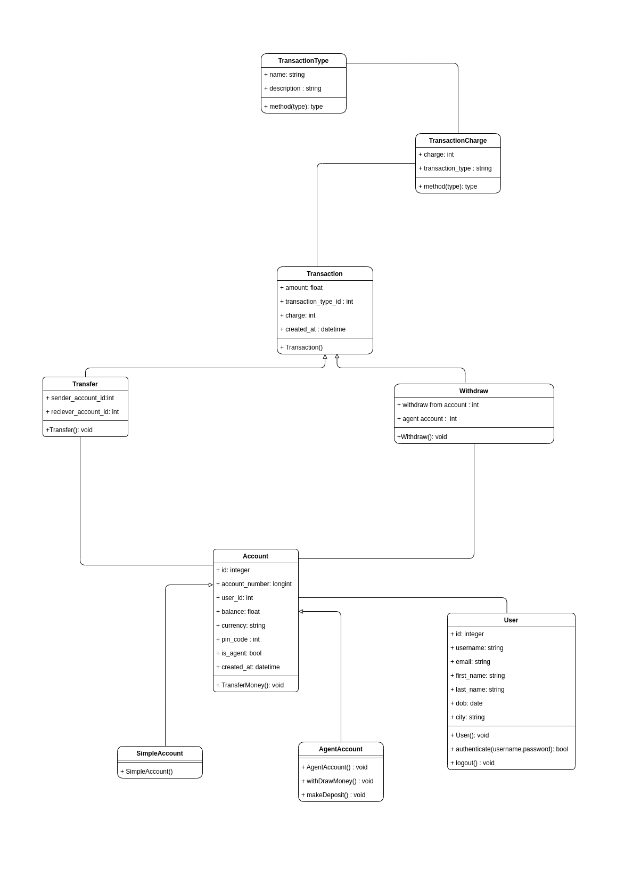
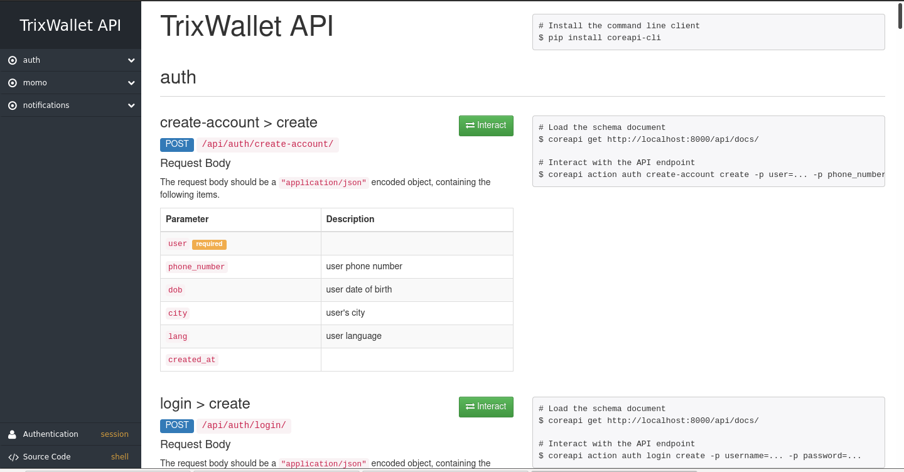
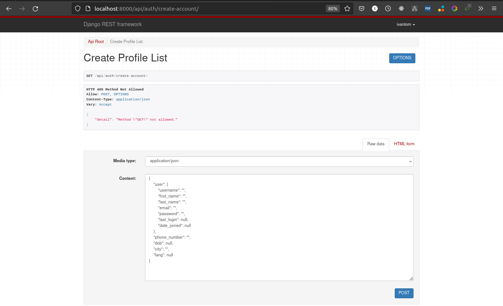

# momo-app-clone


<h1 align="center"> 🌱 Welcome to My Money Transfer app Named TrixMobile Money</h1>

## This is a project on a `money transaction app` made in python using `Django` and `Django Rest Framework` to build `api`

## Technology used
- Django
- Django Rest Framework(DRF) for the `api`
- React native (for the android frontend)
- Rest Framework Swagger to generate the api documentation
## UML Diagram of the app

<a href="./UML/momo-app-clone.drawio.png">

</a>


## Django Backend

### How to run
- Clone the repository with
    ```
    git clone https://github.com/Tomdieu/momo-app-clone.git
    ```
- Navigate to the backend directory
    ```
    cd momo-app-clone/backend
    ```
- Create a virtual environment
    On Linux and macos
    ```
    python3 -m venv env
    ```
    On Windows
    ```
    python -m venv env
    ```
    Or with virtualenv
    ```
    virtualenv env
    ```
- Activate the virtual environment
    On linux and macos
    ```
    source ./env/bin/activate
    ```

    On Windows
    ```
    ./env/Scripts/activate
    ```
- Install the requirements
    ```
    pip -r install requirements.txt
    ```
- Create a superuser
    ```
    python manage.py createsuperuser
    ```
- Run the server with 
    ```
    python manage.py runserver
    ```
- To find the different api routes in the system
    - Navigate to the route `http://localhost:8000/api-doc/`

    - The page will look like this

    

- For example to create a user
    - Navigate to `http://localhost:8000/api/auth/create-account/`
    - The `Post` data must be of these scheme
    ```json
    {
    "user": {
        "username": "",
        "first_name": "",
        "last_name": "",
        "email": "",
        "password": "",
        "last_login": null,
        "date_joined": null
    },
    "phone_number": "",
    "dob": null,
    "city": "",
    "lang": null
}
    ```
    - Example
    